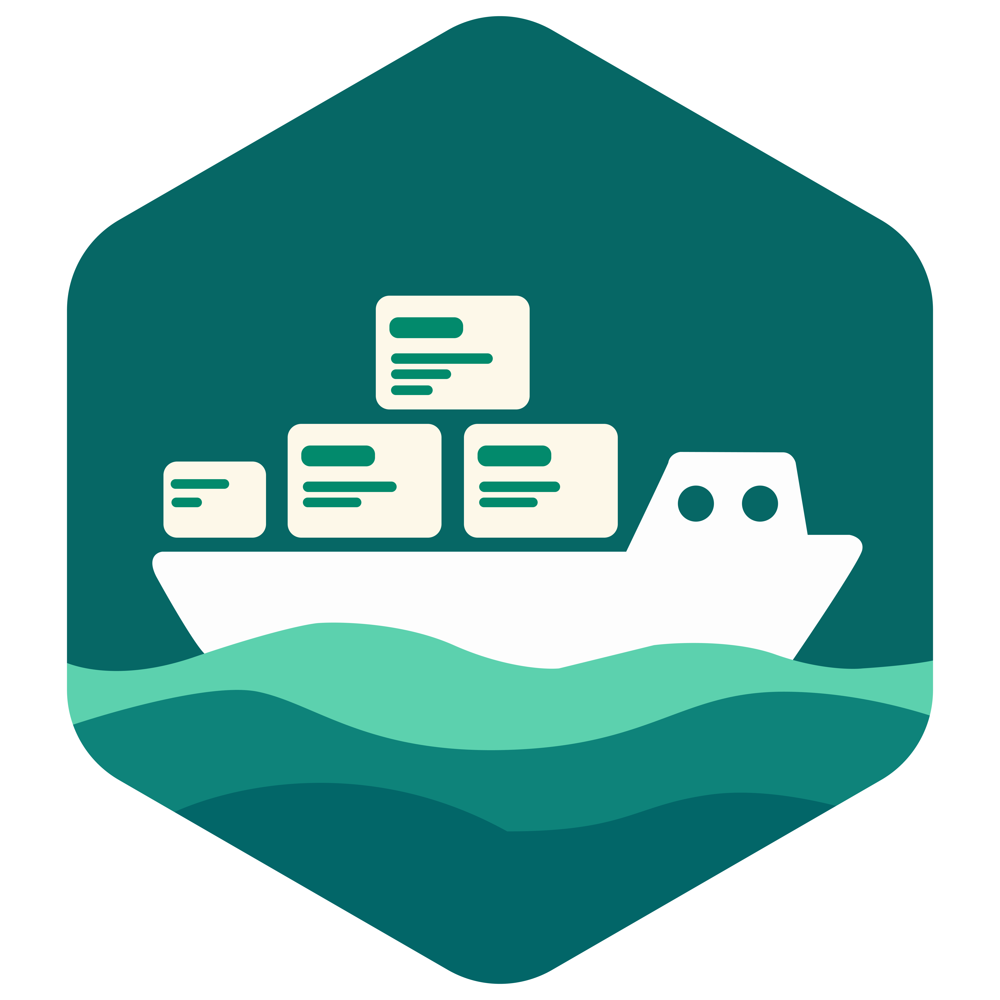

<p align="center">
  
</p>

<h3 align="center">Find the code only one person knows — before they leave.</h3>

<p align="center">
  <a href="https://gitlab.com/codebarge/barge">GitLab</a> ·
  <a href="https://github.com/codebarge/barge">GitHub mirror</a> ·
  <a href="https://gitlab.com/codebarge/barge/-/releases">Releases</a>
</p>

---

**Barge** reads your git history and shows, for every module, who knows it and
how many people would have to leave before nobody does — the *bus factor*.
It runs locally: no code, names or history leave your machine.

```sh
go install gitlab.com/codebarge/barge/cmd/barge@latest
barge scan ~/code/your-project
```

```
RISK      BUS  MODULE                               WHO KNOWS IT
critical    0  internal/core/logger                 Dmitry 92% (inactive)
high        1  internal/features/payments/service   Oleg 86%, Anna 9%
```

Every scan ends with concrete next steps: who should review what, and whose
knowledge to capture first. Before someone leaves, `barge handover` builds a
checklist of the modules only they know, a successor for each, and the
questions worth asking.

### What's here

| Repository | What it is |
| --- | --- |
| [barge](https://github.com/codebarge/barge) | The CLI and analysis library. Go, no dependencies, Apache 2.0 |

### Barge for teams

A shared dashboard across repositories, alerts when a module becomes risky,
short AI-assisted handover interviews, and a knowledge base your AI agents can
query over MCP. Interested in a pilot? [Open an issue](https://gitlab.com/codebarge/barge/-/issues).

<sub>Development happens on GitLab; this organisation hosts a read-only mirror.
Please open issues and merge requests at
[gitlab.com/codebarge/barge](https://gitlab.com/codebarge/barge).</sub>
