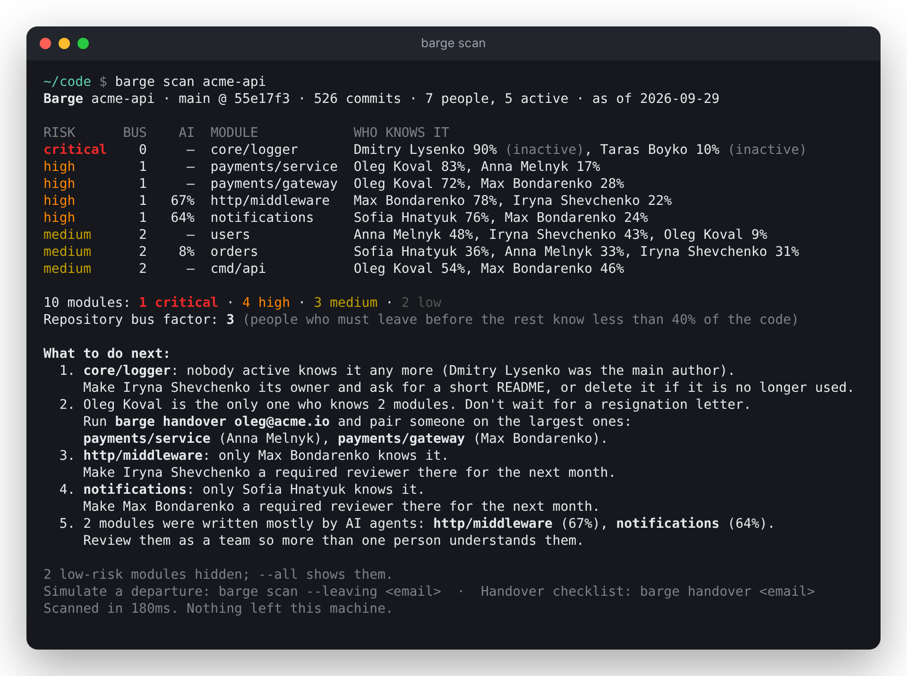
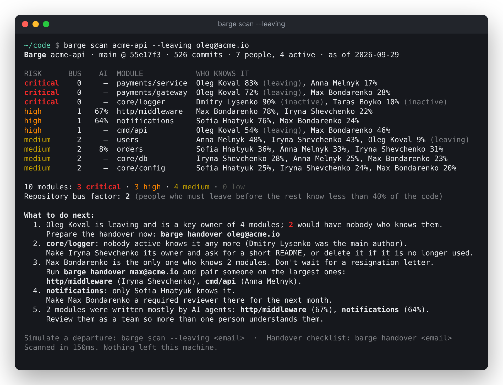
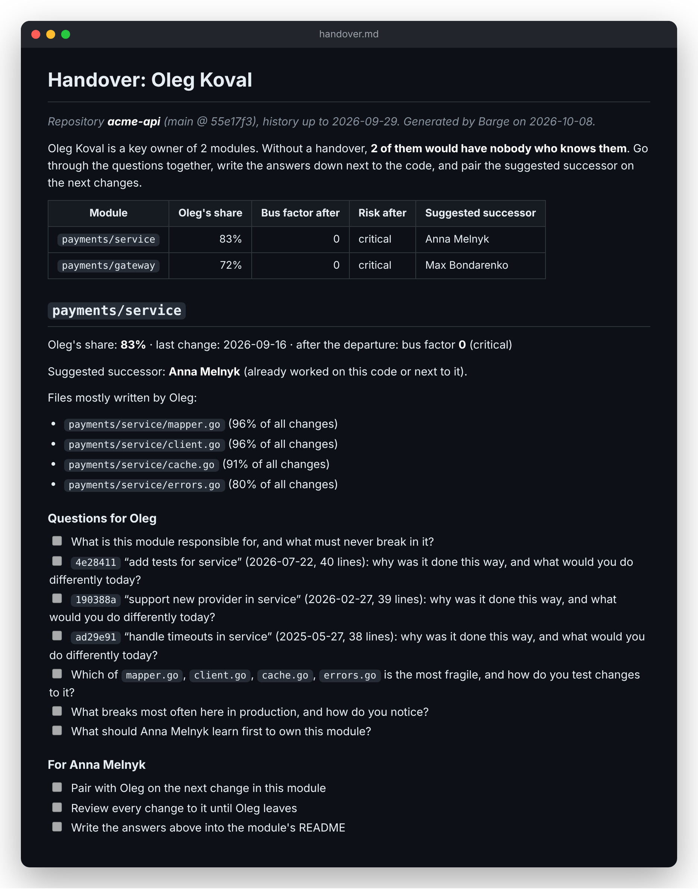

<p align="center">
  
</p>

<h3 align="center">Find the code only one person knows — before they leave.</h3>

<p align="center">
  <a href="https://github.com/codebarge/barge/releases/latest"></a>
  
  
  <a href="https://gitlab.com/codebarge/barge/-/blob/main/LICENSE"></a>
</p>

<p align="center">
  <a href="https://gitlab.com/codebarge/barge/-/blob/main/DOCUMENTATION.md">Documentation</a> ·
  <a href="https://gitlab.com/codebarge/barge/-/releases">Releases</a> ·
  <a href="https://gitlab.com/codebarge/barge/-/blob/main/CHANGELOG.md">Changelog</a> ·
  <a href="https://gitlab.com/codebarge/barge">GitLab</a>
</p>

---

**Barge** reads your git history and shows, for every module, who knows it and
how many people would have to leave before nobody does: the *bus factor*. It
runs on your machine: no code, names or history leave it, and there is no
telemetry.

```sh
go install gitlab.com/codebarge/barge/cmd/barge@latest
barge scan ~/code/your-project
```

<p align="center"></p>

Every scan ends with concrete next steps: who should take over an orphaned
module, who should become a second owner, whose knowledge to capture first.

**What if someone leaves?** `barge scan --leaving oleg@acme.io` shows what
becomes critical without them, before it happens:

<p align="center"></p>

**Before they go**, `barge handover oleg@acme.io -o handover.md` writes a
checklist: the modules only they know, a successor for each, their files and
the questions worth asking:

<p align="center"></p>

<sub>Screenshots from a demo repository; the team is fictional.</sub>

Binaries for Linux, macOS and Windows are on the
[releases page](https://gitlab.com/codebarge/barge/-/releases).

### Repositories

| Repository | What it is |
| --- | --- |
| [barge](https://github.com/codebarge/barge) | The CLI and analysis library. Go standard library only, Apache 2.0 |

### Barge for teams

Everything the CLI does, for all your repositories at once and over time:
a shared dashboard, alerts when a module becomes risky, short AI-assisted
handover interviews before someone leaves, and a knowledge base your AI coding
agents can ask over MCP. Self-hosted or in our cloud.

**[Request a pilot →](https://gitlab.com/codebarge/barge/-/issues/new?issuable_template=Pilot%20request)**
The request is confidential: only you and the maintainers see it.

<sub>Development happens on [GitLab](https://gitlab.com/codebarge/barge); this
organisation hosts a read-only mirror. Report a
[bug](https://gitlab.com/codebarge/barge/-/issues/new?issuable_template=Bug%20report),
suggest a [feature](https://gitlab.com/codebarge/barge/-/issues/new?issuable_template=Feature%20request)
or ask a [question](https://gitlab.com/codebarge/barge/-/issues/new?issuable_template=Question) there.</sub>
